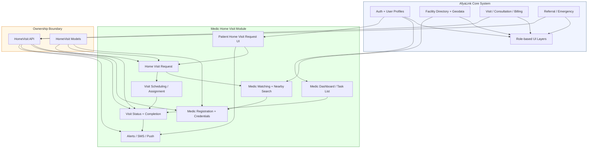

# AfyaLink

AfyaLink is a hospital management platform with role-based dashboards for patients, reception, nurses, doctors, laboratory, pharmacy, billing, supervisors, and system administration.

## New Medic Home Visit Feature

This project is being extended with a modular **Medic Home Visit** feature. The goal is to allow patients to request home visits, match those requests with nearby qualified medics, schedule dispatch, and track completion.

### Why this belongs in the README
- Provides a high-level architecture overview for collaborators
- Documents the new feature boundary and integration points
- Helps you own and scale the feature independently

## Architecture

The new home visit feature is designed as a separate module with its own models, APIs, and UI flows, while reusing shared data where appropriate.

## Feature ownership

The new module should own:

- `Medic` registration and profile data
- `HomeVisitRequest` lifecycle
- medic matching and dispatch logic
- visit status tracking and completion
- notification/alert delivery for requests and assignments

## Integration points

The feature should reuse existing core components for:

- authentication and role management
- facility location and service data
- patient referral and emergency workflows
- visit and billing history where needed

This separation makes it easier to develop, maintain, and eventually scale the home visit feature independently.

## Railway deployment

This project is prepared for Railway hosting with:

- `Procfile` to run Gunicorn via `config.wsgi`
- `requirements.txt` for Python package installation
- `runtime.txt` to pin the Python version
- `config/settings.py` configured for environment-based secrets, debug mode, allowed hosts, and `DATABASE_URL`
- `whitenoise` enabled for static file delivery

### Railway setup

1. Add the repository to Railway.
2. Set Railway environment variables, including:
   - `DJANGO_SECRET_KEY`
   - `DJANGO_DEBUG=False`
   - `DJANGO_ALLOWED_HOSTS=your-railway-app-url`
   - `DATABASE_URL` (Postgres connection string)
3. Run migrations after deployment:
   - `python manage.py migrate`

For local setup, copy `.env.example` to `.env` and update the values.
